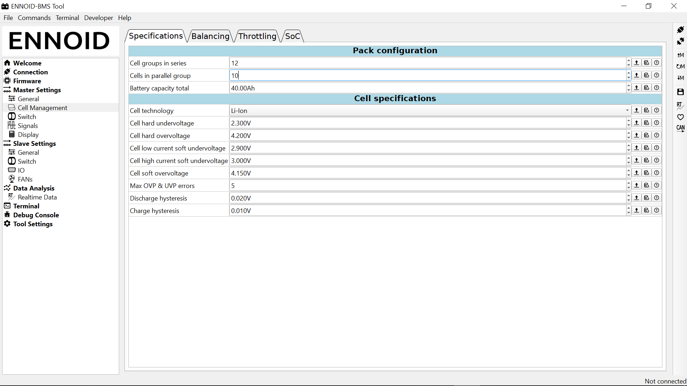

# ENNOID-BMS Tool (based on DieBieMS-Tool)

The ENNOID-BMS tool can be used to configure the ENNOID-BMS, update the firmware.

Latest compiled version can be found in releases.

# Other parts of this project:

[ENNOID-BMS Hardware](https://github.com/EnnoidMe/ENNOID-BMS)

[ENNOID-BMS Bootloader](https://github.com/EnnoidMe/DieBieMS-Bootloader) Same as DieBieMS bootloader Can be flashed with the ENNOID-BMS Tool in the firmware tab or with an STlink-V2.

[ENNOID-BMS Firmware](https://github.com/EnnoidMe/ENNOID-BMS-Firmware) Can be flashed with the ENNOID-BMS Tool in the firmware tab.  

The compiled build .bin and hex files can be found in the MDK-ARM folder [Firmware files](https://github.com/EnnoidMe/ENNOID-BMS-Firmware/blob/master/MDK-ARM/DieBieMS/ENNOID-BMS.bin)
